# Architecture

Real-time, horizontally scalable pub/sub chat. Stateless Go WebSocket gateways
fan messages out through Redis; a worker batches them to Postgres; the gateway
serves history and replay. Observability via Prometheus/Grafana and
OpenTelemetry/Jaeger.

## Component diagram

```mermaid
flowchart LR
  subgraph clients[Clients]
    B1[Browser tab A]
    B2[Browser tab B]
  end

  subgraph gw[Gateway replicas - stateless]
    G1[gateway :8080<br/>WS /ws · REST /api · /metrics · /healthz /readyz]
    G2[gateway :8080<br/>replica N]
  end

  W[persistence worker :8090<br/>PSUBSCRIBE room:* · batcher · /metrics]

  subgraph redis[Redis 7]
    RC[(pub/sub<br/>room:id · presence:id)]
    RZ[(sorted set<br/>presence:room)]
    RS[(counters<br/>seq:room · ratelimit:user)]
  end

  PG[(Postgres 16<br/>messages)]

  subgraph obs[Observability]
    PR[Prometheus :9090]
    GF[Grafana :3000]
    JG[Jaeger :16686<br/>OTLP 4317/4318]
  end

  B1 <-->|WebSocket| G1
  B2 <-->|WebSocket| G2
  B1 -->|GET /api/rooms/&#123;room&#125;/messages| G1

  G1 <-->|PUBLISH / SUBSCRIBE| RC
  G2 <-->|PUBLISH / SUBSCRIBE| RC
  G1 -->|ZADD / ZRANGEBYSCORE| RZ
  G2 -->|ZADD / ZRANGEBYSCORE| RZ
  G1 -->|INCR seq · token bucket| RS
  G1 -->|read history/replay| PG

  RC -->|PSUBSCRIBE room:*| W
  W -->|batch INSERT| PG

  PR -.scrape /metrics.-> G1
  PR -.scrape /metrics.-> W
  GF -.queries.-> PR
  G1 -.OTLP spans.-> JG
  W -.OTLP spans.-> JG
```



## Message lifecycle (a SEND)

```mermaid
sequenceDiagram
  participant A as Client A (gw1)
  participant G1 as Gateway 1
  participant R as Redis
  participant G2 as Gateway 2
  participant B as Client B (gw2)
  participant W as Worker
  participant PG as Postgres

  A->>G1: send {room, text}
  G1->>R: token bucket allow? (ratelimit:user)
  G1->>R: INCR seq:room -> id
  Note over G1: span chat.send; traceparent stamped on frame
  G1->>R: PUBLISH room:id (message frame)
  R-->>G1: deliver (own subscription)
  R-->>G2: deliver
  R-->>W: deliver (PSUBSCRIBE room:*)
  G1-->>A: message (round-trip)
  G2-->>B: message (fan-out)
  Note over W: span chat.consume (linked via traceparent)
  W->>PG: batched INSERT ... ON CONFLICT DO NOTHING
```

## Redis key / channel namespaces

| Name | Type | Purpose |
|------|------|---------|
| `room:{id}` | pub/sub channel | message fan-out (persisted) |
| `presence:{id}` | pub/sub channel | presence snapshots + typing (ephemeral) |
| `presence:{room}` | sorted set | per-room membership, score = last heartbeat ms |
| `seq:{room}` | counter | per-room monotonic message id (`INCR`) |
| `ratelimit:{user}` | hash | token bucket (30 msg/min) |
| `gateway:control` | pub/sub channel | keeps the gateway's pub/sub connection active |

## Key properties

- **Stateless gateways** behind an L4 load balancer; all shared state lives in
  Redis/Postgres, so replicas scale horizontally.
- **Round-trip fan-out:** a SEND publishes to Redis and is delivered back via the
  subscription, giving every client identical ordering.
- **Async persistence:** the worker batches writes (100 msgs or 50ms) with
  idempotent `ON CONFLICT` inserts; the message path never blocks on Postgres.
- **History & replay:** the gateway reads recent/`since`-cursor history from
  Postgres on join and serves a paginated REST endpoint.
- **Graceful shutdown** drains in-flight WebSocket connections; `/healthz` +
  `/readyz` on every service.

See `docs/superpowers/specs/` for the per-slice designs.
